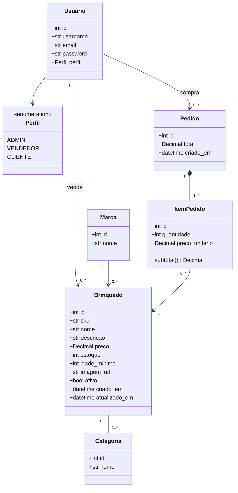

# LudiStore: Diagrama de Classes de Domínio

```mermaid
classDiagram
    class Usuario {
        +int id
        +str username
        +str email
        +str password
        +Perfil perfil
    }
    class Perfil {
        <<enumeration>>
        ADMIN
        VENDEDOR
        CLIENTE
    }
    class Marca {
        +int id
        +str nome
    }
    class Categoria {
        +int id
        +str nome
    }
    class Brinquedo {
        +int id
        +str sku
        +str nome
        +str descricao
        +Decimal preco
        +int estoque
        +int idade_minima
        +str imagem_url
        +bool ativo
        +datetime criado_em
        +datetime atualizado_em
    }
    class Pedido {
        +int id
        +Decimal total
        +datetime criado_em
    }
    class ItemPedido {
        +int id
        +int quantidade
        +Decimal preco_unitario
        +subtotal() Decimal
    }

    Usuario --> Perfil
    Usuario "1" --> "0..*" Brinquedo : vende
    Usuario "1" --> "0..*" Pedido : compra
    Marca "1" --> "0..*" Brinquedo
    Brinquedo "0..*" -- "1..*" Categoria
    Pedido "1" *-- "1..*" ItemPedido
    ItemPedido "0..*" --> "1" Brinquedo
```